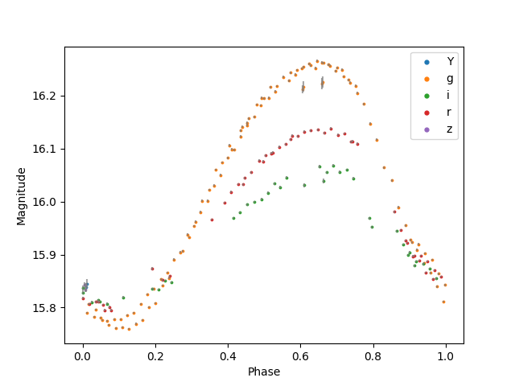

*****************************
Getting Started with Variable
*****************************

Imports
=======

.. code-block:: python

	from leavitt.timeseries import Variable
	from leavitt.utils import phase_fold, plot_phased_lightcurve

There are two main ways to initialize a ``Variable`` object.

1. Using the NSC ID (objectid) of a star. We'll do that here. This performs a synchronous query to the DataLab catalog.
2. Giving it a TimeSeries object.

.. code-block:: python
   
	star = Variable('150537_4644')

This object now has an attribute called ``timeseries`` which contains the timeseries data.

.. code-block:: python

	star.timeseries

================= ========= =========== ====== =======
  time            mag_auto  magerr_auto filter exptime
================= ========= =========== ====== =======
 Time             float64   float64     str1   int64
----------------- --------- ----------- ------ -------
57113.05614621984 15.811543 0.001926    i      150
57112.05490842834 15.801223 0.001874    r      150
57112.13323347038 15.954048 0.002102    g      150
57113.08296847297 15.759274 0.001752    g      150
57112.25814789068 16.2586   0.002162    g      150
----------------- --------- ----------- ------ -------
...               ...       ...         ...    ...
----------------- --------- ----------- ------ -------
57112.27053951612 16.24863  0.002241    g      150
57113.00249109836 15.955009 0.001944    g      150
57112.22724048141 16.239832 0.002429    g      150
57112.20861871168 16.207851 0.002292    g      150
57112.22103560204 16.228163 0.002224    g      150
================= ========= =========== ====== =======

Periodogram
===========

Now, we can perform a Lomb-Scargle multiband to find the period of the star (it may take a while). This is a RRc star with a period of 0.3367 days.

.. code-block:: python

	frequency, power = star.ls_mb_periodogram()
	period, error = star.get_period(frequency, power)

The period and errors are stored in the new variables, but also a new attribute called ``period`` that stores the period only.

.. code-block:: python

	print('{:.5f} +/- {:.5f} days'.format(period.value,error.value))
	print('{:.5f} days'.format(star.period.value))

::
	
  0.33667 +/- 0.00004 days
  0.33667 days
	
We can now get the data to construct a phased lightcurve.

.. code-block:: python

	phase = phase_fold(star.timeseries['time'],period)
	plot_phased_lightcurve(phase, star.timeseries['mag_auto'],mags_errs=star.timeseries['magerr_auto'],filters=star.timeseries['filter'])

